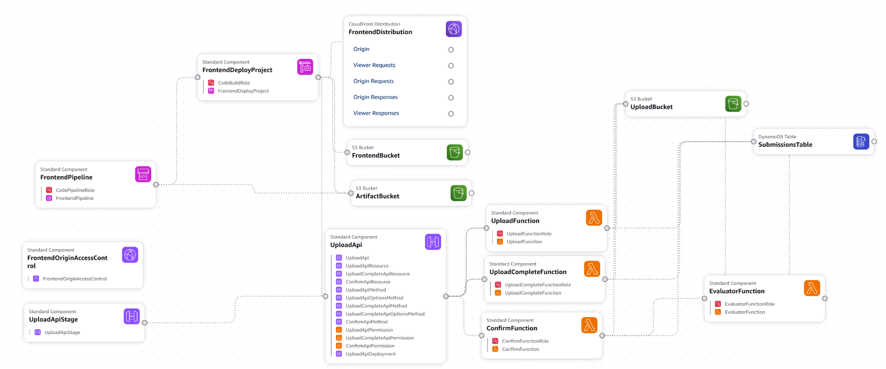

# Chess Move Validator

Validate chess moves, example in `move_file`.

A static web UI accepts an email address and chess move text file; the backend stores the pending submission, sends a confirmation link, processes confirmed files, records status/results, and emails the outcome.

After a successful upload, the page shows `AWAITING_CONFIRMATION` until the recipient uses the emailed link. Each link is bound to its submission, expires after 24 hours by default.

A CodePipeline watches the `main` GitHub branch and invokes CodeBuild on each change. CodeBuild synchronizes `frontend/` to the private origin bucket and creates a CloudFront invalidation.

## Prerequisite

Create and authorize an AWS CodeConnections connection to GitHub in `eu-central-1`. Verify the SES sender address that you set as `CONFIRMATION_EMAIL_FROM`.
Copy `.env.example` to `.env`, then add the connection ARN, repository settings, and verified sender address.

## Infrastructure

The stack is defined in `infrastructure/cmw-infra.yml`. 

AWS Infrastructure for the project:



- **Pipeline**: `FrontendPipeline` watches `main` and runs `FrontendDeployProject`, which syncs `frontend/` to the private `FrontendBucket` and invalidates the `FrontendDistribution`. 
- **Frontend**: Static web UI in S3 for user interaction. The bucket is OAC. 
- **API**: Endpoints for upload-complete and confirm routes.
- **Compute**: `UploadFunction` creates the submission and presigned URL, `UploadCompleteFunction` records the upload and sends the confirmation email, `ConfirmFunction` consumes the token and hands off to `EvaluatorFunction`, which evaluates the move file.
- **Data** — uploaded move files land in the private `UploadBucket`. Submission state and results are stored in the `SubmissionsTable`.

## Deploy

Deploy in Region: `eu-central-1`.

```bash
./scripts/deploy-cmw-infra.sh
```

The pipeline will redeploy `frontend/` automatically. 
The website address output:

```bash
aws cloudformation describe-stacks \
  --region eu-central-1 \
  --stack-name chess-move-validator-stack \
  --query "Stacks[0].Outputs[?OutputKey=='FrontendUrl'].OutputValue" \
  --output text
```
