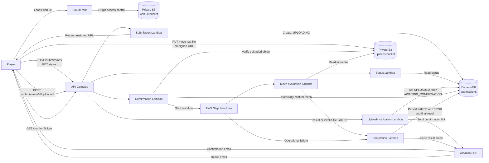
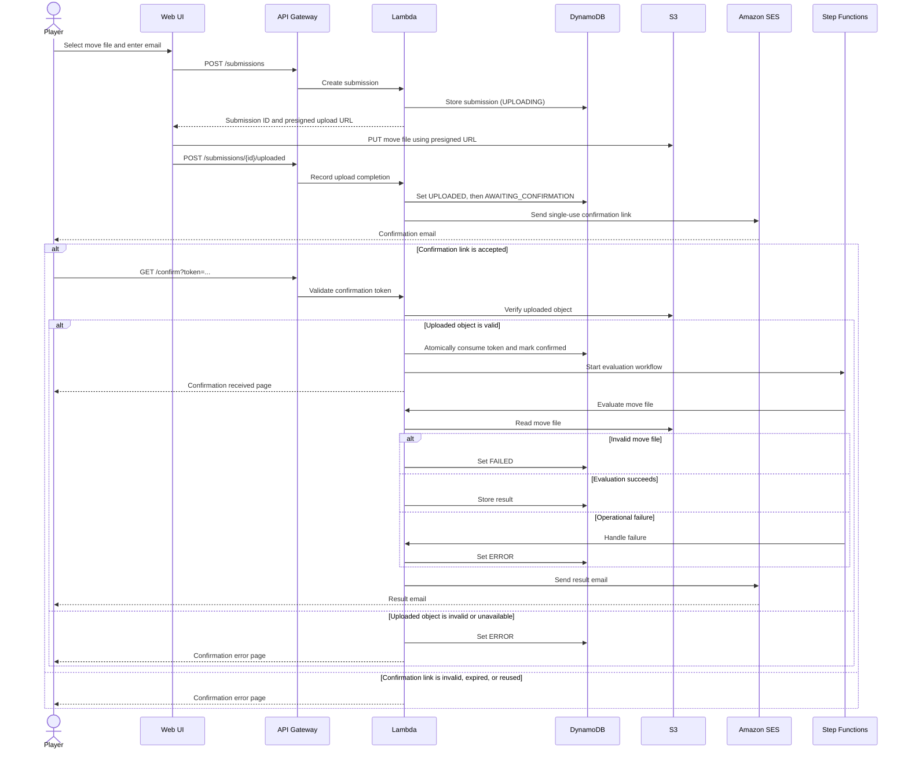

# CMV AWS Serverless Infrastructure Plan

## Summary

Build a development-only, event-driven AWS system entirely through CloudFormation. A static web UI accepts an email address and chess move text file; the backend stores the pending submission, sends a confirmation link, processes confirmed files asynchronously, records status/results, and emails the outcome.

Use AWS-managed URLs initially. SES sender-domain verification remains a deployment parameter/prerequisite, rather than being hard-coded.

## Architecture and Flow

1. CloudFront serves the single-page web UI from a private S3 bucket.
2. The UI calls API Gateway to create a submission, obtain a short-lived presigned S3 upload URL, report that the direct upload has completed, and query submission status.
3. The submission Lambda creates the DynamoDB record with status `UPLOADING` and returns the presigned URL. After the UI reports the upload, a Lambda records `UPLOADED`, transitions it to `AWAITING_CONFIRMATION`, and sends an SES email containing a single-use token link.
4. The confirmation route in API Gateway validates the token, verifies the uploaded object, atomically marks the submission confirmed, and starts a Step Functions workflow.
5. The workflow invokes separate Lambda functions for move-file evaluation and completion handling. Completion persists the final status/result in DynamoDB and sends the result email through SES; invalid move-file evaluation produces `FAILED`, while operational failures produce `ERROR`.
6. The UI displays only submission status: `UPLOADING` while the file is being transferred, `UPLOADED` after transfer completes, `AWAITING_CONFIRMATION` until the email link is clicked, `FAILED` for an invalid move file, and `ERROR` for system, upload, or delivery failures. Detailed evaluation output is delivered by email.

## Architecture Diagram

## Submission Sequence

## CloudFormation Delivery

- Use a root CloudFormation template with nested templates for:
  - frontend delivery (S3, CloudFront, origin access control);
  - API and compute (API Gateway, Lambdas, Step Functions);
  - data and uploads (S3 uploads bucket, DynamoDB);
  - messaging/security/observability (SES permissions/configuration, IAM, CloudWatch alarms/log retention).
- Parameterize stack name, deployment environment, GitHub connection ARN, GitHub repository/branch, SES sender address/domain, allowed upload size, confirmation-link expiry, and log-retention period.
- Create a development CodePipeline using GitHub through CodeStar Connections:
  - source trigger from the selected branch;
  - CodeBuild validation/package stage;
  - CloudFormation change set and deploy stage;
  - frontend build/deploy plus CloudFront invalidation.
- Avoid CodeCommit and CodeArtifact. Keep dependencies in source/package them during CodeBuild so the account's service restrictions do not shape the runtime design.

## Security, Reliability, and Operations

- Keep both S3 buckets private; CloudFront is the only reader of the UI bucket. Upload access is restricted to presigned PUT URLs, a text-file content type, and a configurable small maximum size.
- Encrypt S3 and DynamoDB at rest, block public S3 access, enable S3 versioning for frontend assets, and apply lifecycle rules for upload cleanup.
- Use dedicated least-privilege IAM roles per Lambda, the state machine, and CI/CD.
- Store only the user email, object key, opaque confirmation-token hash, timestamps, workflow state, and final result/status. Enable DynamoDB TTL to remove expired unconfirmed submissions and expired tokens.
- Require confirmation tokens to be random, URL-safe, hashed at rest, time-limited, and consumed atomically. Confirmation retries must be idempotent.
- Enforce API-level request validation plus backend rate limiting/size checks. Do not add WAF in the initial development stack.
- Add CloudWatch structured logs, retained for a configurable short development period; alarms for Lambda failures, Step Functions failures, API Gateway 5xx errors, and mail-send failures.
- Configure retry and failure handling in Step Functions. Terminal failures update the submission status and trigger the failure-result email.

## Application Interfaces

- `POST /submissions`: accepts email and file metadata; returns submission ID and a presigned upload URL.
- `POST /submissions/{id}/uploaded`: records upload completion and initiates the confirmation-email step.
- `GET /confirm?token=...`: consumes the confirmation token, returns a minimal confirmation page/response, and starts processing.
- `GET /submissions/{id}/status`: returns only the UI lifecycle status: `UPLOADING`, `UPLOADED`, `AWAITING_CONFIRMATION`, `FAILED`, or `ERROR`.
- The move evaluator remains an isolated Lambda contract: input is an S3 object key and submission ID; output is final position, game result, move count, or a structured processing error. Chess validation rules are deliberately deferred.

## Test Plan

- CloudFormation linting, template validation, and change-set creation in the pipeline.
- Infrastructure integration tests for private S3 access, CloudFront delivery, presigned-upload restrictions, API authorization/validation, DynamoDB TTL fields, and IAM least-privilege boundaries.
- End-to-end development test: `UPLOADING` -> `UPLOADED` -> `AWAITING_CONFIRMATION` -> confirmation email -> token confirmation -> workflow completion -> status-only UI response -> result email.
- Failure tests: invalid move file returns `FAILED`; expired/reused token, missing/oversized/wrong-type upload, duplicate callback, SES send failure, and workflow retry exhaustion return `ERROR`.

## Assumptions

- The first deployment is development-only and uses AWS-provided CloudFront/API domains.
- GitHub is the source host; a CodeStar Connection is created or supplied separately during deployment.
- SES sender identity and production SES exit-from-sandbox approval are external AWS-account prerequisites. Until then, recipient testing is limited by SES sandbox rules.
- A confirmation link expires after 24 hours by default; uploaded source files are retained for 30 days by default.
- "Basic limits" excludes WAF/CAPTCHA in this release; these are planned additions before an unrestricted public production launch.
