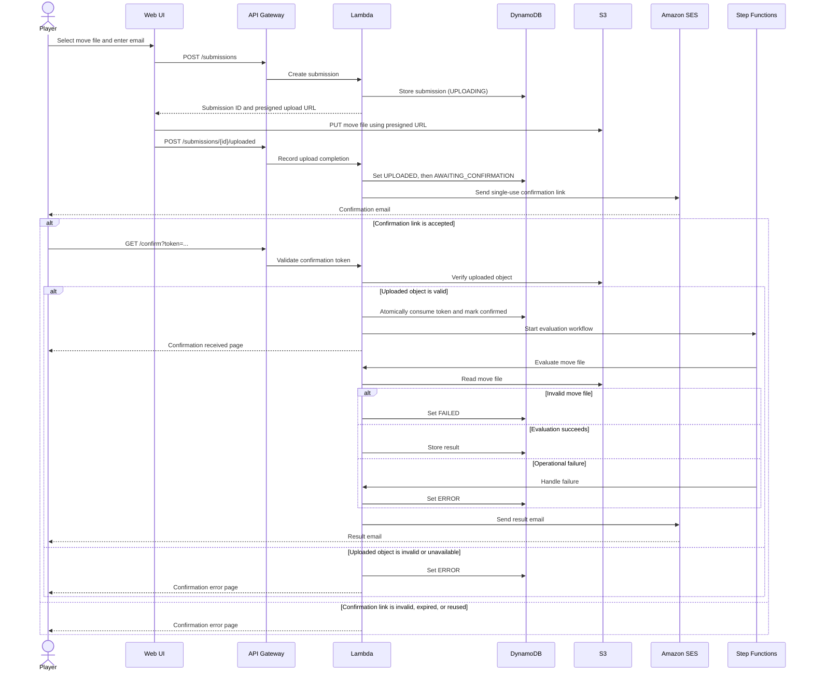

# CMV AWS Serverless Infrastructure Plan

## Architecture and Flow

1. CloudFront serves the single-page web UI from a private S3 bucket.
2. The UI calls API Gateway to create a submission, obtain a short-lived presigned S3 upload URL, report that the direct upload has completed, and query submission status.
3. The submission Lambda creates the DynamoDB record with status `UPLOADING` and returns the presigned URL. After the UI reports the upload, a Lambda records `UPLOADED`, transitions it to `AWAITING_CONFIRMATION`, and sends an SES email containing a single-use token link.
4. The confirmation route in API Gateway validates the token, verifies the uploaded object, atomically marks the submission confirmed, and starts a Step Functions workflow.
5. The workflow invokes separate Lambda functions for move-file evaluation and completion handling. Completion persists the final status/result in DynamoDB and sends the result email through SES; invalid move-file evaluation produces `FAILED`, while operational failures produce `ERROR`.
6. The UI displays only submission status: `UPLOADING` while the file is being transferred, `UPLOADED` after transfer completes, `AWAITING_CONFIRMATION` until the email link is clicked, `FAILED` for an invalid move file, and `ERROR` for system, upload, or delivery failures. Detailed evaluation output is delivered by email.

## Sequence Diagram

## API

- `POST /submissions`: accepts email and file metadata; returns submission ID and a presigned upload URL.
- `POST /submissions/{id}/uploaded`: records upload completion and initiates the confirmation-email step.
- `GET /confirm?token=...`: consumes the confirmation token, returns a minimal confirmation page/response, and starts processing.
- `GET /submissions/{id}/status`: returns only the UI lifecycle status: `UPLOADING`, `UPLOADED`, `AWAITING_CONFIRMATION`, `FAILED`, or `ERROR`.
- The move evaluator remains an isolated Lambda contract: input is an S3 object key and submission ID; output is final position, game result, move count, or a structured processing error. Chess validation rules are deliberately deferred.